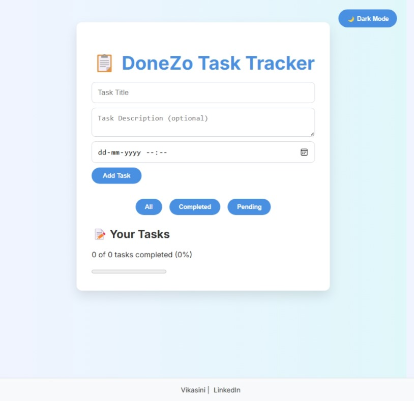
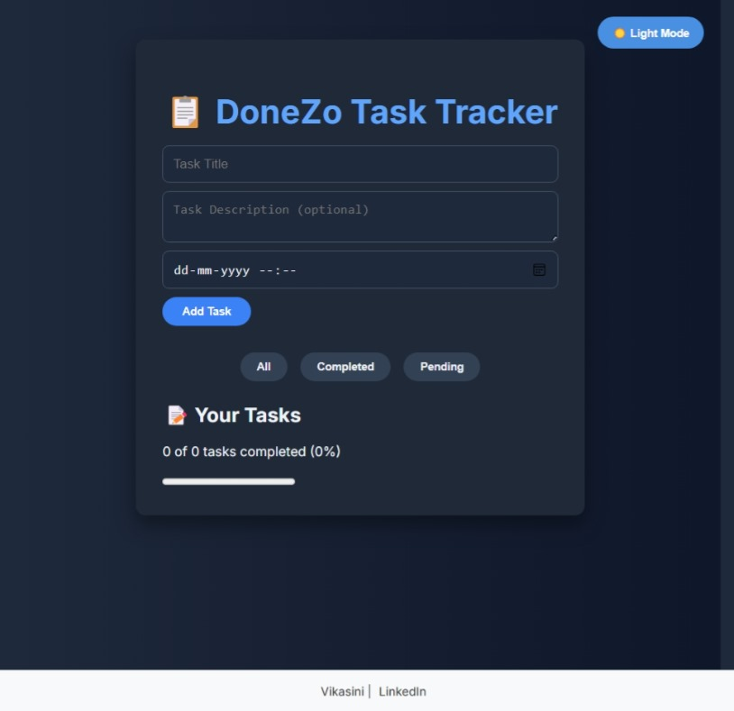

# **DoneZo Task Tracker** ✅  

Welcome to **DoneZo Task Tracker**! 📝🚀  
This is a simple and efficient task management web app designed to help users organize their tasks effortlessly.  

---

## **About** ℹ️  
This project is a **task tracker application** that allows users to:  
- Add, update, and delete tasks easily.  
- Filter tasks based on **status** (All, Completed, Pending).  
- Track progress dynamically with a **completion percentage**.  
- Switch between **light and dark mode** for better usability.  

---

## **Technologies Used** 🛠️  

I have implemented the following technologies to build this project:  

- **HTML**: Structuring the web page elements.  
- **CSS (Tailwind CSS)**: Styling the UI with a minimalistic and modern approach.  
- **JavaScript**: Handling user interactions and task management logic.  

---

## **Features** ✨  

✅ **Task Management** – Add, update, and delete tasks.  
✅ **Progress Tracking** – Displays task completion percentage dynamically.  
✅ **Responsive Design** – Optimized for different screen sizes.  
✅ **Dark Mode Toggle** – User-friendly light/dark mode switch.  
✅ **Interactive UI** – Clean and modern design for a smooth experience.  

---

## **How to Use** 🛠️  

1. **Enter a task title and description** (optional).  
2. **Pick a due date** for the task.  
3. **Click "Add Task"** to save the task.  
4. **Filter tasks** using the "All," "Completed," or "Pending" buttons.  
5. **Click the task to mark it as completed** or delete it if needed.  
6. **Use the dark mode toggle** to switch themes.  

---

## **App Screenshots** 🖼️

### 🌞 Light Mode  

### 🌙 Dark Mode  

---

## **Footer Design** 🖥️  

The footer remains at the bottom of the page and contains:  
👤 **Vikasini Mohanasundaram** | 🔗 **[LinkedIn](https://www.linkedin.com/in/vikasinim)**  

---

## **Important Notice** 🔒  

This project is **for personal use and learning purposes only**.  
Please **do not copy, replicate, or distribute** any part of this project without permission.  

---

## **Contact** 📬  

📧 Email: [vikasiniias@gmail.com](mailto:vikasiniias@gmail.com)  
🌐 LinkedIn: [linkedin.com/in/vikasinim](https://www.linkedin.com/in/vikasinim)  

Feel free to connect with me for **collaborations, feedback, or opportunities**! 🤝🎯  

---
